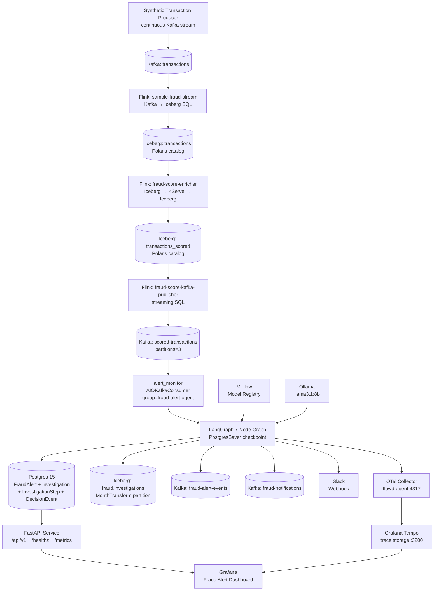
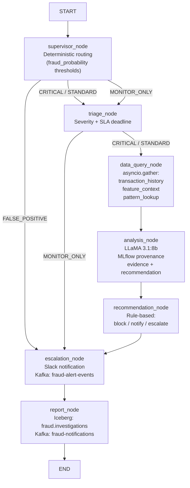
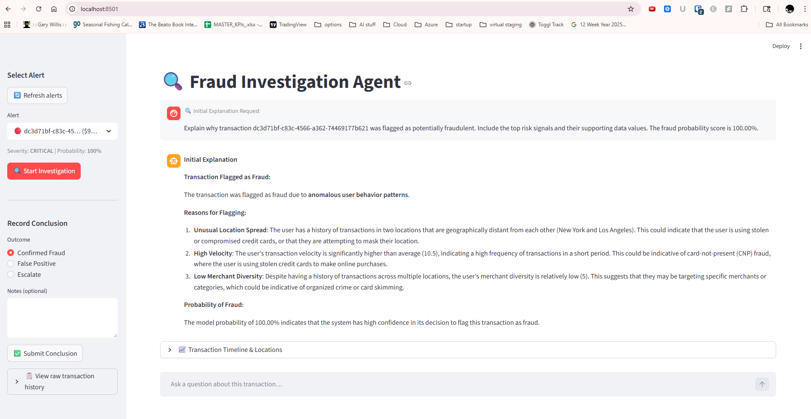
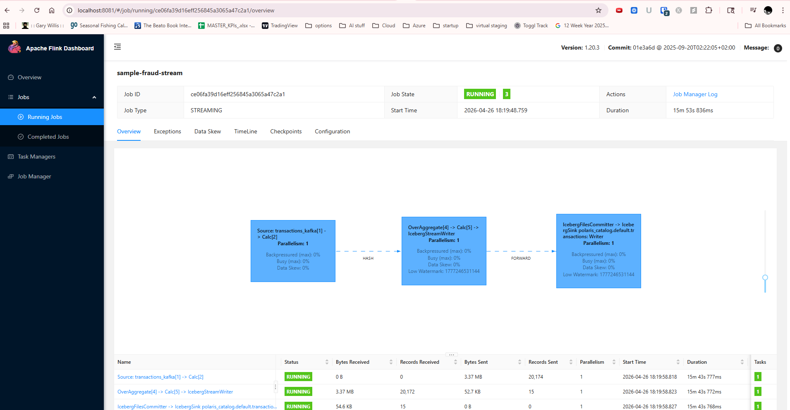
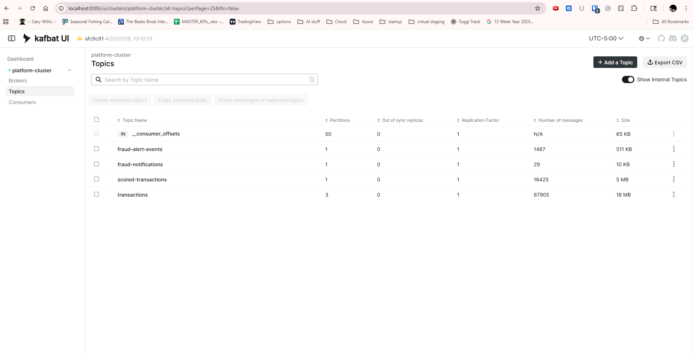
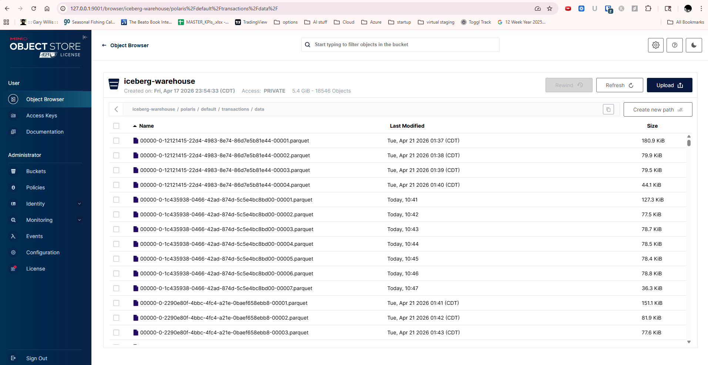
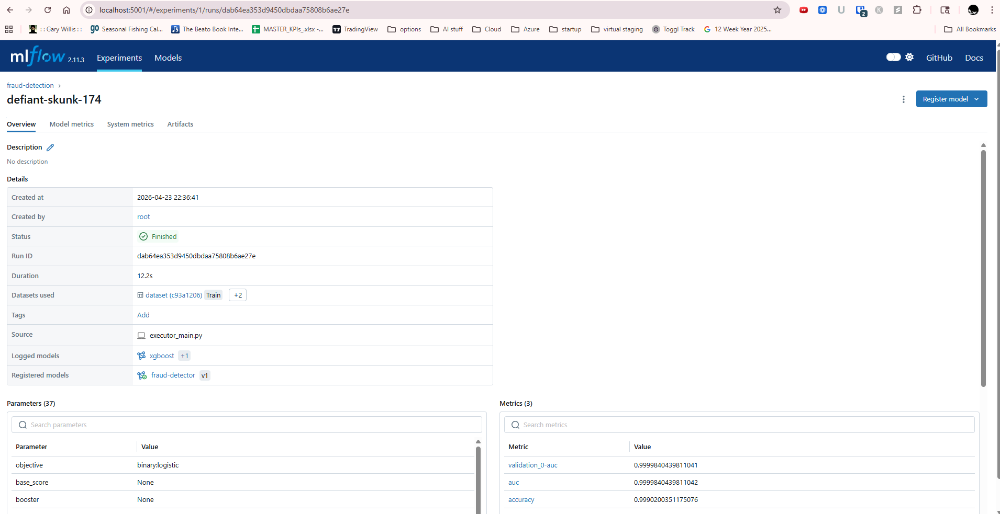
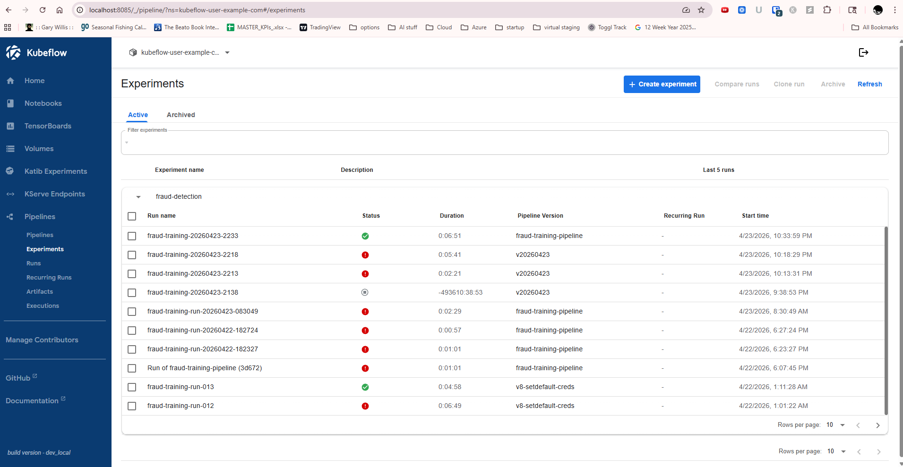
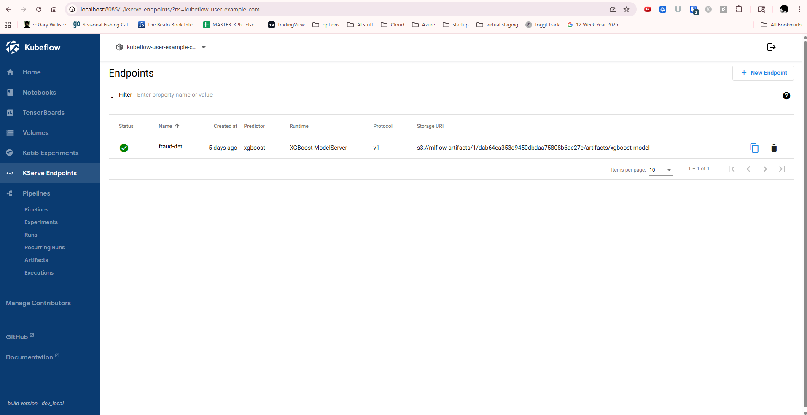
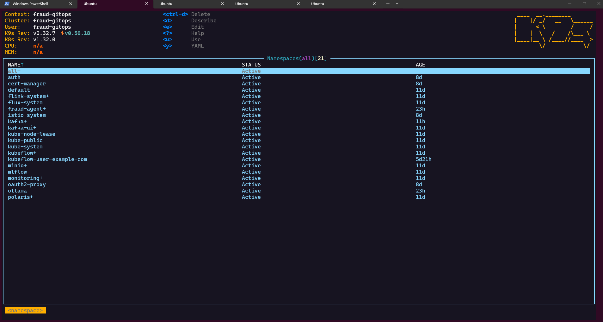

# Kafka → Flink → Iceberg Fraud Detection Platform

A GitOps-managed, locally-runnable fraud detection platform built on Minikube. The system ingests synthetic payment transactions, scores them in streaming fashion using Apache Flink (`ModelScorerJob` calls a KServe-hosted XGBoost inference endpoint per row), and feeds scored events to an autonomous LangGraph multi-agent pipeline that investigates, classifies, and archives each fraud alert — end-to-end without human involvement unless escalation is required. All infrastructure, applications, and reconciliation order are managed by FluxCD from a single Git repository.

**Key capabilities:**

- Real-time transaction scoring at stream speed via Flink (async HTTP to KServe), Iceberg reads/writes (Polaris catalog on MinIO)
- Autonomous 7-node LangGraph investigation pipeline driven by Ollama (llama3.1:8b) with durable PostgreSQL checkpoints
- Event-driven alert ingestion from Kafka with sub-5s lag from score to investigation start
- Analyst-facing Streamlit UI for reviewing, approving, and overriding agent decisions
- Full distributed trace per investigation via OpenTelemetry → Grafana Tempo
- Analytics-ready `fraud.investigations` Iceberg table partitioned by month for historical querying
- P95 investigation time under 60 seconds including LLM inference

---

## Technology Stack

| Category | Technology | Role |
|---|---|---|
| **GitOps** | FluxCD | Reconciles all manifests from `clusters/minikube`; enforces `infra-controllers → infra-configs → apps` order |
| **Local Kubernetes** | Minikube | Single-node cluster; Docker driver; GPU-optional for Ollama |
| **Manifest layering** | Kustomize | Base/overlay pattern for all workloads |
| **Event streaming** | Apache Kafka (Strimzi) | `transactions`, `scored-transactions`, `fraud-alert-events`, `fraud-notifications` topics |
| **Stream processing** | Apache Flink (Flink Kubernetes Operator) | `ModelScorerJob` (Iceberg → KServe HTTP → Iceberg) + streaming SQL publisher |
| **Open table format** | Apache Iceberg | `transactions`, `transactions_scored`, `fraud.investigations` tables |
| **Iceberg catalog** | Apache Polaris | REST catalog backed by MinIO; OAuth2 credentials for Flink |
| **Object storage** | MinIO | S3-compatible store for Iceberg data files and MLflow artifacts |
| **LLM inference** | Ollama | Local llama3.1:8b; GPU-tolerant deployment; no external API calls |
| **ML model registry** | MLflow | XGBoost model versioning and provenance for analysis_node |
| **ML platform** | Kubeflow | Notebooks, pipelines, and KServe endpoint hosting |
| **Fraud scoring model** | XGBoost | Offline-trained on Kubeflow Pipelines; served by KServe (`fraud-detector` InferenceService); Flink `ModelScorerJob` invokes the KServe V2 infer API per transaction row |
| **Agent framework** | LangGraph | 7-node stateful investigation graph with PostgresSaver checkpointing |
| **Agent tooling** | LangChain | 7 registered tools: transaction history, feature context, pattern lookup, explanation, and more |
| **API service** | FastAPI | `/api/v1` endpoints for alerts, investigations, decisions, sessions; `/healthz`; `/metrics` |
| **Analyst UI** | Streamlit | Chat-style investigation review and decision override interface |
| **Alert persistence** | PostgreSQL 15 | `FraudAlert`, `Investigation`, `InvestigationStep`, `DecisionEvent` tables + LangGraph checkpoints |
| **DB migrations** | Alembic | Schema versioning for the fraud-agent Postgres database |
| **Metrics** | Prometheus | Scrapes FastAPI `/metrics` and infrastructure components |
| **Dashboards** | Grafana | Fraud alert dashboard; Iceberg latency panels; trace integration |
| **Distributed tracing** | OpenTelemetry Collector | Receives OTLP spans from the fraud-alert-agent; forwards to Tempo |
| **Trace storage** | Grafana Tempo | 72-hour trace retention; linked from Grafana |
| **Notifications** | Slack Webhook | Escalation alerts from `escalation_node` |
| **Tracing (optional)** | LangSmith | Remote LangGraph trace export; enabled via `LANGCHAIN_API_KEY` env var |

---

## Architecture

### End-to-End System Flow



| Component | Technology | Purpose |
|---|---|---|
| Synthetic Transaction Producer | Python + aiohttp | Continuously generates realistic test transactions and publishes to the `transactions` Kafka topic |
| Kafka: transactions | Strimzi | Raw transaction stream |
| sample-fraud-stream | Flink SQL (`flink_streaming_job.sql`) | Consumes `transactions` Kafka; writes Iceberg `transactions` |
| Iceberg: transactions | Polaris REST catalog | Landing table for raw transactions before ML scoring |
| fraud-score-enricher | Flink (ModelScorerJob) | Reads Iceberg `transactions` (streaming), calls KServe, writes `transactions_scored` |
| Iceberg: transactions_scored | Polaris REST catalog | Source of truth for scored transactions |
| fraud-score-kafka-publisher | Flink SQL (streaming) | Incremental Iceberg → Kafka fan-out |
| Kafka: scored-transactions | Strimzi (3 partitions) | Event-driven feed for alert_monitor |
| alert_monitor | AIOKafkaConsumer | Consumes scored-transactions; creates alerts; launches investigations |
| LangGraph 7-Node Graph | LangGraph + PostgresSaver | Investigation pipeline with durable checkpoints |
| Postgres 15 | K8s StatefulSet | Alert/investigation/decision persistence + LangGraph checkpoints |
| Iceberg: fraud.investigations | Polaris REST catalog | Analytics-ready investigation archive (MonthTransform) |
| OTel Collector | otel/opentelemetry-collector-contrib | Receives OTLP spans from app, forwards to Tempo |
| Grafana Tempo | grafana/tempo | Distributed trace storage (72h retention) |

### LangGraph 7-Node Investigation Graph



| Node | LLM | Iceberg | MLflow | Kafka | Key outputs |
|---|---|---|---|---|---|
| supervisor_node | — | — | — | — | `route` |
| triage_node | — | — | — | — | `severity`, `sla_deadline` |
| data_query_node | — | Read (3 tables) | — | — | `transaction_history`, `feature_values`, `pattern_stats`, `snapshot_ids` |
| analysis_node | LLaMA 3.1:8b | — | Yes | — | `explanation`, `evidence`, `recommended_action`, `confidence` |
| recommendation_node | — | — | — | — | `final_action`, `rule_matched` |
| escalation_node | — | — | — | Write: fraud-alert-events | `kafka_delivered` |
| report_node | — | Write: fraud.investigations | — | Write: fraud-notifications | `iceberg_snapshot_id`, `kafka_delivered` |

---

## Documentation

### Setup

| Document | Description |
|---|---|
| [Installation](docs/installation.md) | Step-by-step: Minikube start, credentials, cluster secrets, image builds, and Flux bootstrap |
| [Bootstrap Runbook](docs/runbooks/bootstrap.md) | Minikube sizing, GPU options, Flux bootstrap, reconciliation order, and troubleshooting |
| [Secret Management](docs/runbooks/secret-management.md) | How secrets are handled in this public repo; kubectl patterns; SOPS guidance |
| [FluxCD Commands](docs/FLUX.md) | Common FluxCD CLI commands for reconciliation, suspension, and debugging |

### Testing & Verification

| Document | Description |
|---|---|
| [End-to-End Test](docs/end-to-end-test.md) | Full pipeline verification: inject transaction → score → alert → investigation → decision |
| [Verify Kafka → Flink → Iceberg](docs/runbooks/verify-kafka-flink-iceberg.md) | Step-by-step checks for the streaming path from Kafka through Flink into the Polaris catalog |

### Component References

| Document | Description |
|---|---|
| [Architecture](docs/architecture.md) | Full system flow diagrams, Kafka topic schema, and Iceberg table layout |
| [Fraud Score Enricher](docs/FRAUD_SCORE_ENRICHER.md) | Flink `ModelScorerJob`: Iceberg streaming source, async KServe V2 inference calls, Iceberg `transactions_scored` sink |
| [Flink Operations](docs/FLINK.md) | Flink SQL, job submission, and operator patterns used in this repo |
| [Kubeflow on Minikube](docs/KUBEFLOW.md) | Kubeflow installation details, notebook setup, and pipeline authoring |
| [MLOps Pipeline Runbook](docs/mlops-pipeline-runbook.md) | Training pipeline, model promotion, and MLflow integration |

### Runbooks

| Document | Description |
|---|---|
| [Runbooks Index](docs/runbooks/README.md) | Overview of all operational runbooks |
| [Fraud Alert Agent](docs/runbooks/fraud-alert-agent.md) | Operations: health checks, investigation procedures, alert lifecycle |
| [Reconciliation & Rollback](docs/runbooks/reconciliation.md) | FluxCD reconciliation order, suspension, and rollback procedures |
| [Flink Job Recovery](docs/runbooks/flink-job-recovery.md) | Recovering Flink jobs from savepoints and handling failures |
| [Flink Checkpoints](docs/runbooks/flink-checkpoints.md) | Checkpoint and savepoint configuration on MinIO (S3A) |
| [Grafana Dashboards](docs/runbooks/grafana-dashboards.md) | Dashboard provisioning and the streaming pipeline panels |

---

## Repository Layout

```text
clusters/          # Flux entrypoint and Kustomization reconciliation order
infrastructure/    # Shared platform controllers and cluster-wide config
apps/
  base/            # Workload manifests: fraud-alert-agent, flink-jobs, ollama, kafka, etc.
  minikube/        # Minikube-specific overlays
src/
  fraud-alert-agent/   # FastAPI service + LangGraph agents + LangChain tools
  streamlit-ui/        # Analyst investigation chat UI
docs/              # Architecture diagrams, runbooks, and component references
specs/             # Feature specs, implementation plans, and task lists
scripts/           # Utility and verification scripts
```

## Public Repo Rules

- Do not commit plaintext `Secret` manifests, kubeconfigs, tokens, passwords, TLS private keys, or `.env` files.
- Create Kubernetes secrets directly in the cluster with `kubectl create secret` and keep them out of Git.
- SOPS or external secret managers are optional future enhancements.

## Screenshots

**Fraud Investigation UI**


**Flink Dashboard**


**Kafka UI**


**MinIO Object Store**


**MLflow Experiments**


**Kubeflow Experiments**


**Kubeflow KServe Endpoint**


**k9s Namespaces**

