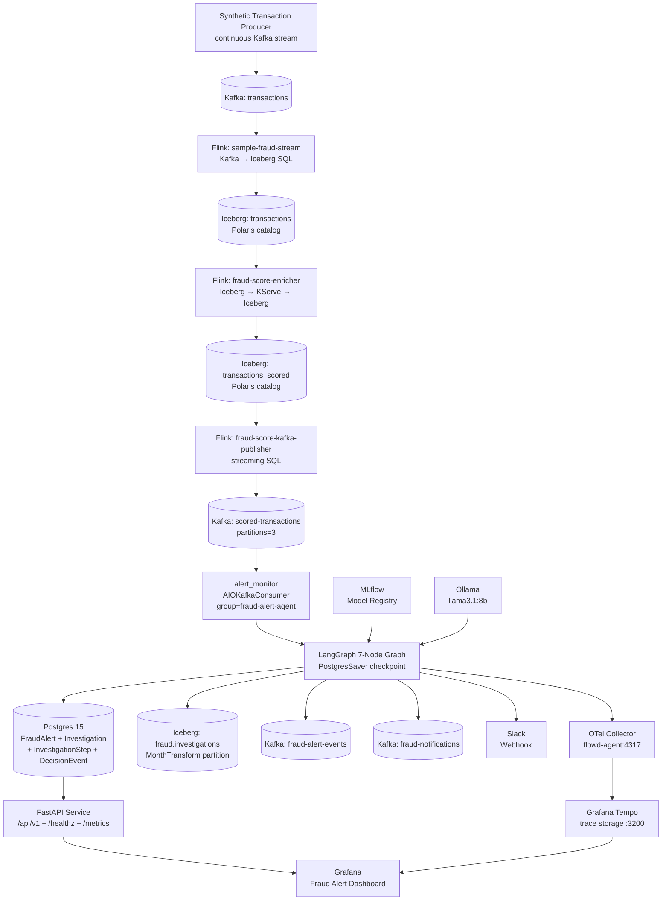
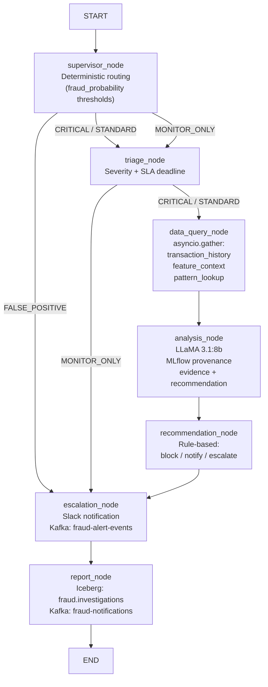

# System Architecture: Kafka → Flink → Iceberg → Fraud Alert Agent

## Diagram 1 — End-to-End System Flow

### Component Table

| Component | Technology | Purpose |
|-----------|------------|---------|
| Synthetic Transaction Producer | Python + aiohttp | Continuously generates realistic test transactions and publishes to the `transactions` Kafka topic |
| Kafka: transactions | Strimzi | Raw transaction stream |
| sample-fraud-stream | Flink SQL (`flink_streaming_job.sql`) | Consumes `transactions` Kafka; writes Iceberg `transactions` |
| Iceberg: transactions | Polaris REST catalog | Landing table for raw transactions before ML scoring |
| fraud-score-enricher | Flink (ModelScorerJob) | Reads Iceberg `transactions` (streaming), calls KServe, writes `transactions_scored` |
| Iceberg: transactions_scored | Polaris REST catalog | Source of truth for scored transactions |
| fraud-score-kafka-publisher | Flink SQL (streaming) | Incremental Iceberg → Kafka fan-out |
| Kafka: scored-transactions | Strimzi (3 partitions) | Event-driven feed for alert_monitor |
| alert_monitor | AIOKafkaConsumer | Consumes scored-transactions; creates alerts; launches investigations |
| LangGraph 7-Node Graph | LangGraph + PostgresSaver | Investigation pipeline with durable checkpoints |
| Postgres 15 | K8s StatefulSet | Alert/investigation/decision persistence + LangGraph checkpoints |
| Iceberg: fraud.investigations | Polaris REST catalog | Analytics-ready investigation archive (MonthTransform) |
| OTel Collector | otel/opentelemetry-collector-contrib | Receives OTLP spans from app, forwards to Tempo |
| Grafana Tempo | grafana/tempo | Distributed trace storage (72h retention) |

---

## Diagram 2 — LangGraph 7-Node Graph

### Node Responsibility Table

| Node | LLM | Iceberg | MLflow | Kafka | Key outputs |
|------|-----|---------|--------|-------|-------------|
| supervisor_node | — | — | — | — | `route` |
| triage_node | — | — | — | — | `severity`, `sla_deadline` |
| data_query_node | — | Read (3 tables) | — | — | `transaction_history`, `feature_values`, `pattern_stats`, `snapshot_ids` |
| analysis_node | LLaMA 3.1:8b | — | Yes | — | `explanation`, `evidence`, `recommended_action`, `confidence` |
| recommendation_node | — | — | — | — | `final_action`, `rule_matched` |
| escalation_node | — | — | — | Write: fraud-alert-events | `kafka_delivered` |
| report_node | — | Write: fraud.investigations | — | Write: fraud-notifications | `iceberg_snapshot_id`, `kafka_delivered` |

---

## Data Flow

### Kafka Topics

| Topic | Producer | Consumer | Schema |
|-------|----------|----------|--------|
| `transactions` | Synthetic producer | Flink sample-fraud-stream | `{transaction_id, user_id, amount, merchant, lat, lon, ts}` |
| `scored-transactions` | Flink fraud-score-kafka-publisher | alert_monitor | `{transaction_id, user_id, amount, merchant, fraud_probability, amount_velocity_5min, distance_from_home_km, ts, processing_time}` |
| `fraud-alert-events` | escalation_node, sla_worker | Downstream | `{event_type, timestamp, source, payload: {alert_id, final_action, severity, ...}}` |
| `fraud-notifications` | report_node | Downstream | `{event_type, timestamp, source, payload: {alert_id, final_action, iceberg_snapshot_id, investigation_id}}` |

### Iceberg Tables

| Table | Namespace | Writer | Partition |
|-------|-----------|--------|-----------|
| `transactions` | default | Flink sample-fraud-stream (`flink_streaming_job.sql`) | date |
| `transactions_scored` | default | Flink ModelScorerJob | date |
| `fraud.investigations` | fraud | report_node (PyIceberg) | MonthTransform on investigation_completed_at |

---

For local dev commands and integration scenarios, see [`specs/004-fraud-alert-agent/quickstart.md`](../specs/004-fraud-alert-agent/quickstart.md).
